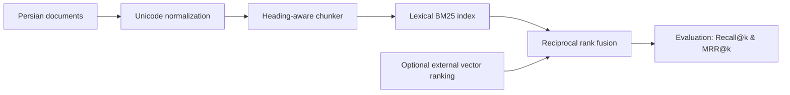

# Architecture and design decisions

This package is a **retrieval foundation**, not a hosted RAG service.

## Modules

- `normalization`: Arabic-to-Persian script normalization, digits, diacritics, ZWNJ-aware tokens.
- `chunking`: Markdown heading boundaries; no overlap between unrelated heading paths; approximate token budget.
- `search`: immutable **in-memory inverted-postings** BM25 index; query work is proportional to matching postings instead of a full-document scan (results still require sorting).
- `fusion`: deterministic weighted RRF; accepts lists of document identifiers from **any** retrieval provider.
- `evaluation`: macro Recall@k and MRR@k for labelled query-to-document rankings.

## Boundaries / trade-offs

1. **No embedding provider coupling.** Vector searches happen outside this package. Feed their document-ID order to RRF.
2. **No production PostgreSQL schema.** Hamkalam's SQL / tenant-specific retrieval was intentionally not exported.
3. **No LLM, prompts or model-output safety guarantees.** The package returns ranked documents, not answers.
4. **Search tokenization is heuristic.** Half-spaces, word morphology, and short colloquial queries may require corpus-specific tuning.
5. **Chunk token size is approximate.** Use a model-specific tokenizer and validation for strict context-window budgets.
6. **BM25 is in-memory.** For sizable collections use a durable search backend and preserve the clean fusion interface.
7. **No hard-coded performance claims.** Run evaluations on your own held-out corpus and report dataset, denominator and retrieval configuration.
8. **Duplicate vector IDs are ignored before rank assignment**, and a source with weight zero contributes no documents.
9. **Long heading paths fail explicitly** when the configured approximate token budget cannot fit the prefix. Passing the budget is based on a character heuristic, not model tokens.

## Provenance

The Persian normalization and heading-aware chunking were adapted from
`hamkalam/backend/app/rag/{persian,chunker}.py`; RRF was adapted from the
Hamkalam hybrid retriever. Product-specific database, tenant, embedding,
credentials, and company/domain concerns are intentionally absent.
The standalone BM25 index and evaluation interface were written for
this repository.

## Release gate

Only publish when (a) the licensing rights are confirmed; (b) Python 3.11–3.13
unit tests, Ruff, strict mypy, branch coverage, package build and Docker test pass; and (c) no credentials,
private datasets, or embedded environment files are committed.
